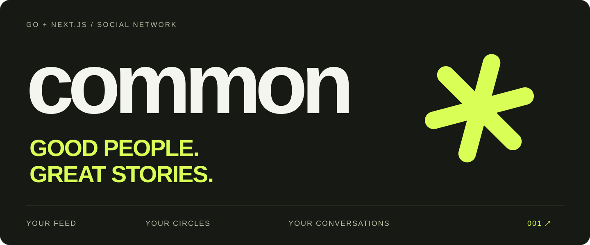

<p align="center">
  
</p>

<p align="center">
  <a href="https://github.com/hujaafar/social-network/actions/workflows/quality.yml"></a>
  
  
  
</p>

<p align="center">
  <a href="#run-common">Run Common</a> ·
  <a href="docs/USING_COMMON.md">Explore the experience</a> ·
  <a href="docs/ARCHITECTURE.md">Architecture</a> ·
  <a href="docs/REDESIGN.md">Design &amp; motion</a> ·
  <a href="docs/VALIDATION.md">Validation</a> ·
  <a href="CONTRIBUTING.md">Contributing</a>
</p>

## A social space for real life

**Common** brings your people, conversations and interests together. An editorial social network with a cinematic visual identity, a responsive interface and a real Go/SQLite backend.

The experience pairs electric lime, charcoal and condensed typography with original campaign photography. Native scrolling, restrained image depth, responsive conversation layouts and reduced-motion support keep the interface usable while giving it a distinctive character.

> The redesign is available on [`feat/common-social-redesign`](https://github.com/hujaafar/social-network/tree/feat/common-social-redesign), under review in [PR #1](https://github.com/hujaafar/social-network/pull/1).


*Original generated campaign photography; the people shown are illustrative. This is an art-direction image, not an application screenshot.*

## Inside Common

| Your space | What you can do |
|---|---|
| **Feed** | Switch between the latest posts and accepted follows; open conversations without replacing your feed. |
| **Saved posts** | Bookmark moments in your own persistent collection; saved posts respect their authors' current audiences. |
| **Quick search** | Find people, circles and pages from anywhere with Control/Command K, arrow keys and Enter. |
| **Composer** | Share text and JPEG/PNG/GIF media, drag in an image, choose an audience, and keep your draft while browsing. |
| **Privacy** | Use public or private profiles and choose public, followers-only or selected-follower post audiences. |
| **Circles** | Find groups, request membership, invite people, share posts and organize events with RSVP. |
| **Messages** | Search contacts, send live messages and emoji, and move between contacts and conversations on mobile. |
| **Activity** | Respond to follow requests and group invitations, review updates, and mark notifications read. |
| **Profile** | Share your bio, manage your connections and update your account details. |

## Run Common

Requirements: **Node.js 22+**, **Go 1.22+**, npm. Docker is optional.

```sh
git clone --branch feat/common-social-redesign https://github.com/hujaafar/social-network.git
cd social-network
```

**With Docker**

```sh
docker compose up --build
```

Open [localhost:3000](http://localhost:3000) and create an account. Separate images run the frontend and API; named volumes hold the database and uploaded media.

**Without Docker**

Start the API from `backend/`:

```sh
cd backend
go run .
```

Start the frontend in a second terminal:

```sh
cd frontend
npm ci
npm run dev
```

The default API is [localhost:8080](http://localhost:8080). Set `DATABASE_PATH` to a new filename for a fresh local database; the default filename refers to a legacy tracked database. Integration tests always use temporary data. No demonstration credentials are seeded.

For another API host, copy `frontend/.env.example` to `.env.local` and set `NEXT_PUBLIC_API_URL` before building. Set `FRONTEND_ORIGIN` on the Go process to the exact frontend origin. See [configuration details](docs/ARCHITECTURE.md#configuration).

## Built to be worked on

Want a populated local feed? The [optional demo seed](docs/DEMO_DATA.md) adds clearly labeled fictional profiles, photo posts, comments and reactions to an isolated development database.

```text
frontend/src/
  app/                  Routes, metadata, shared theme and auth campaign
  components/design/    Application shell and scroll-linked imagery
  components/           Feed, circles, profiles, notifications and chat
  lib/                  API addresses, SWR hooks and WebSocket provider
backend/
  server/               HTTP routing and temporary-database integration tests
  app/                  Domain handlers, SQLite and migrations
docs/                   Architecture, design, asset provenance and validation
```

The backend confirms private-message persistence before the client clears its draft. Notification references use SQL nullability correctly. API addresses are centralized, and runtime configuration separates browser-facing URLs from Docker service names.

## Quality checks

From `frontend/`:

```sh
npm run format:check
npm run lint
npm run build
```

From `backend/`:

```sh
go test ./... -count=1
go vet ./...
```

GitHub Actions runs frontend and backend checks separately. Integration journeys cover authentication, posts, uploads, likes, comments, saved collections, following feeds, audience changes, Unicode limits, transactional deletion, circle membership, events, RSVP, notifications and live messaging. [The validation record](docs/VALIDATION.md) distinguishes automated checks from browser testing and deployment work.

## Design notes

- **Typography:** Manrope for the working interface; Barlow Condensed for campaign headings; Geist Mono for small section markers.
- **Palette:** charcoal `#161914`, electric lime `#d9ff57`, paper `#f4f5ee` and cobalt accents.
- **Motion:** scroll-linked photographs, one-time feed entry, route transitions and hover feedback. Reduced-motion preferences disable animated movement.
- **Assets:** original generated photographs with [the exact prompts retained](docs/IMAGE_PROMPTS.txt). UI text, controls and the repository wordmark remain editable source.

## Authors

Original project contributors remain credited:

- [Ali Hasan](https://github.com/AliHJMM)
- [Habib Mansoor](https://github.com/7abib04)
- [Mohamed Alasfoor](https://github.com/Mohamed-Alasfoor)
- [Hussain Jawad](https://github.com/hujaafar)
