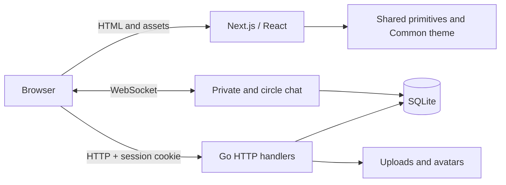
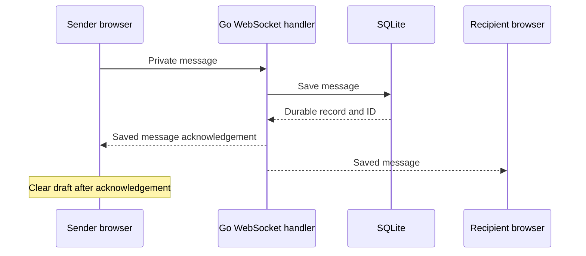

# How Common fits together

Common retains the project's Go HTTP server, SQLite persistence and Next.js App Router. The redesign changes presentation and fixes several interaction contracts without replacing the backend.

## Application boundaries

| Boundary | Responsibility | Source |
|---|---|---|
| Next.js routes | Feed, account flows, circles, profiles, notifications and chat | `frontend/src/app` |
| Shared identity | Navigation, editorial images, theme and authentication spread | `frontend/src/components/design`, `frontend/src/app/auth.css` |
| Client data | SWR caches, credentialed HTTP and WebSocket origin configuration | `frontend/src/lib` |
| HTTP entry point | Bind runtime port and construct application handlers | `backend/server/server.go` |
| Domain handlers | Sessions, visibility, membership, posts, events and conversations | `backend/app` |
| Storage | SQLite connection configuration and ordered migrations | `backend/app/db` |

`server.NewHandler(db)` is used by both the running API and the integration test. That keeps the tested routes aligned with the application. The test uses a temporary database and temporary filesystem for uploads.

## Message delivery

The sender retains the draft until acknowledgement. If confirmation does not arrive within ten seconds, the interface reports uncertainty instead of declaring delivery. HTTP history and socket messages are merged by durable IDs. Reconnect timers and stale history requests are cleaned up when conversations or connections change.

## Configuration

| Variable | Process | Default |
|---|---|---|
| `NEXT_PUBLIC_API_URL` | Frontend, resolved at build time | `http://localhost:8080` |
| `FRONTEND_ORIGIN` | Go API | `http://localhost:3000` |
| `PORT` | Go API | `8080` |
| `DATABASE_PATH` | Go API | `social_network.db` |
| `MIGRATIONS_PATH` | Go API | `file://app/db/migrations` |

The public API URL must be reachable by the browser. A Docker service name is not a browser address. Run the Go process from `backend/` for the default relative migration and media paths.

Docker Compose isolates the database, uploads and avatars in named volumes, with published ports bound to localhost. A production host needs a long-running Go process, persistent storage, WebSocket support and appropriate HTTPS/session configuration. This app is not a static export or a Cloudflare Worker bundle.

## Verification boundaries

Integration journeys exercise representative behavior; they do not establish complete authorization or security coverage. See [the validation record](VALIDATION.md) for tests actually run and remaining verification work.
